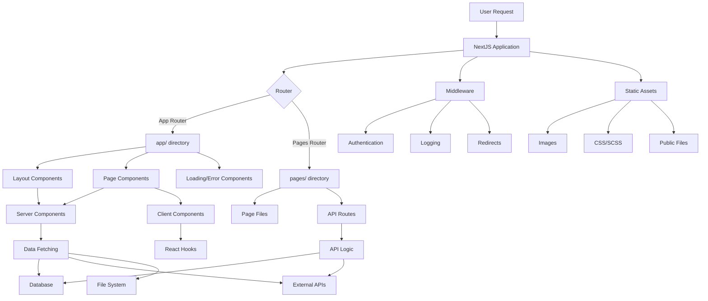
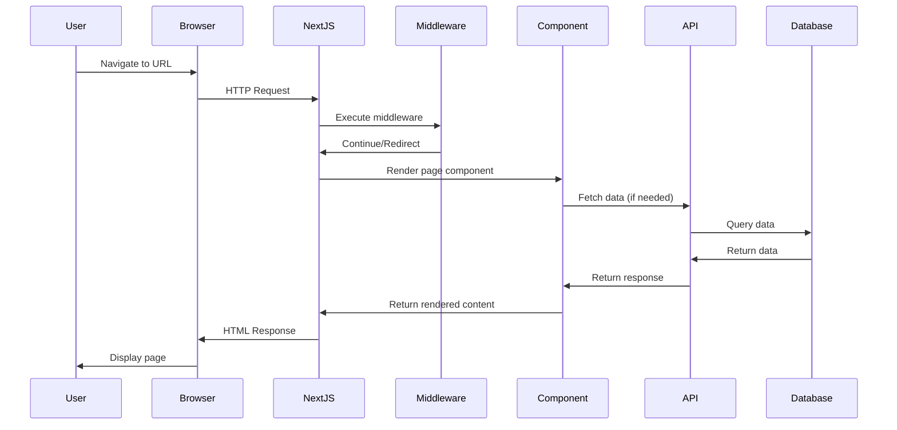
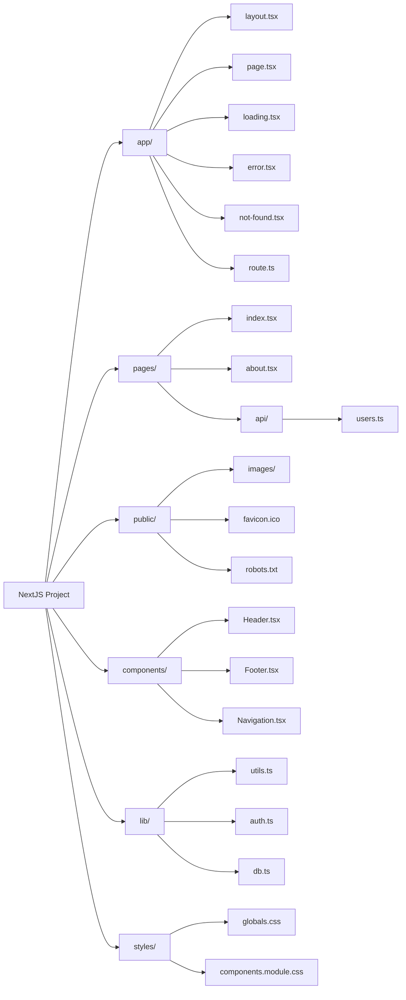
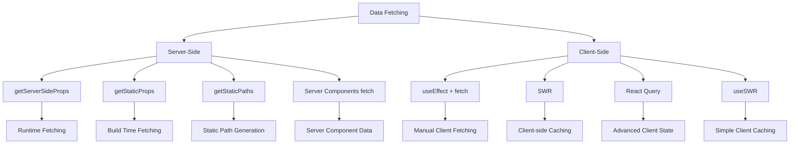
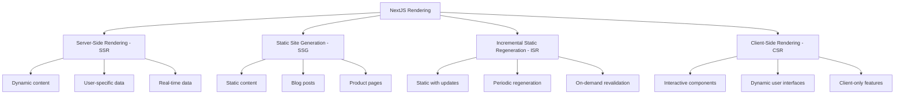
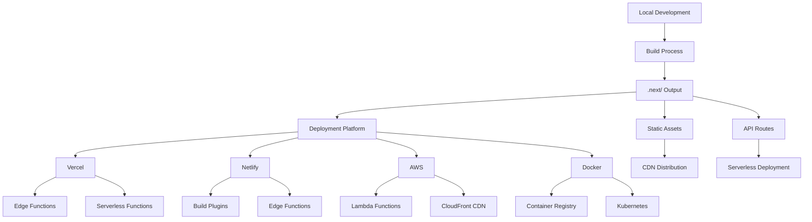

# NextJS Application Architecture

This document provides a visual representation of a typical NextJS application architecture using Mermaid diagrams.

## Application Structure Overview

## Request Flow Architecture

## File Structure Diagram

## Data Fetching Patterns

## Rendering Strategies

## Deployment Architecture

## Key NextJS Concepts

- **App Router**: New routing system (app/ directory) with layouts and nested routing
- **Pages Router**: Traditional routing system (pages/ directory)
- **Server Components**: React components that render on the server
- **Client Components**: React components that render in the browser
- **API Routes**: Backend API endpoints within the NextJS application
- **Middleware**: Code that runs before requests are processed
- **Static Generation**: Pre-rendering pages at build time
- **Server-Side Rendering**: Rendering pages on each request
- **Incremental Static Regeneration**: Updating static pages after deployment